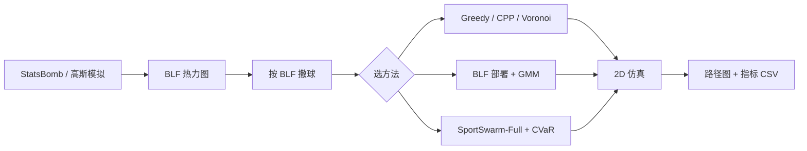
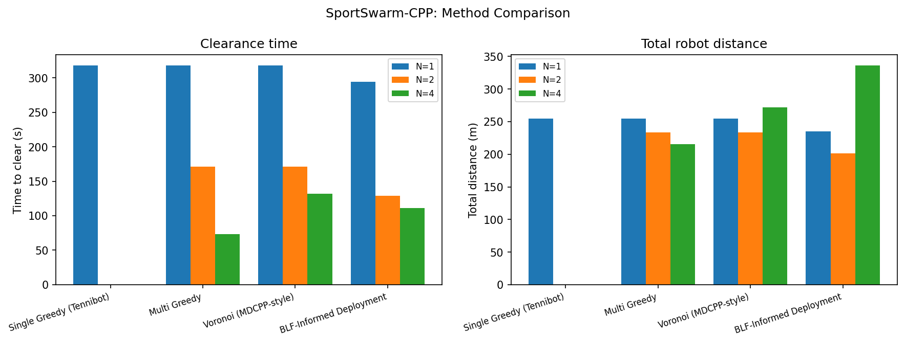
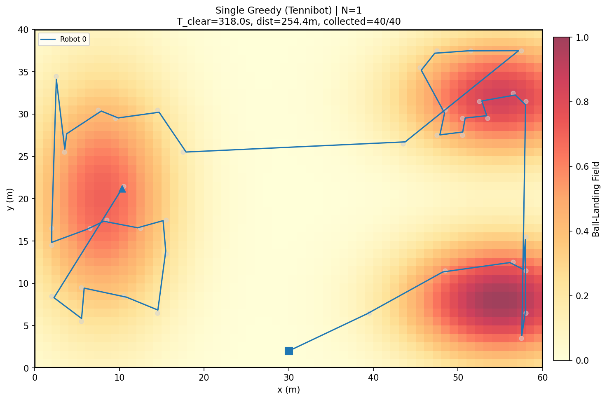
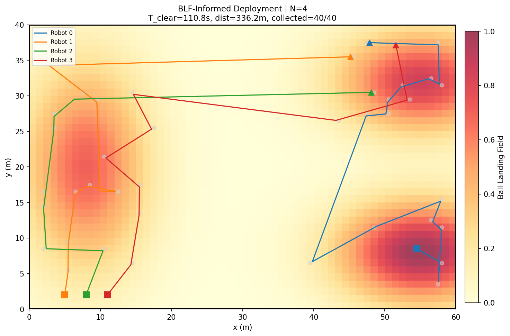
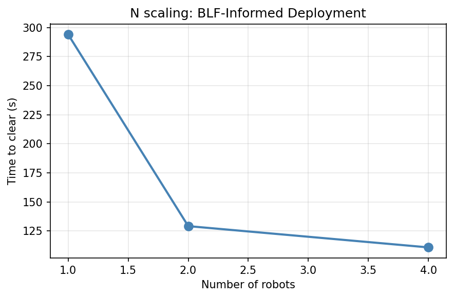
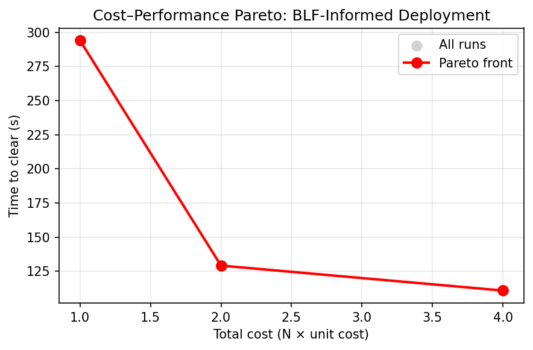
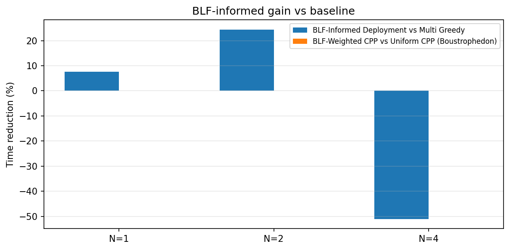

# SportSwarm-CPP

**Data-Informed Multi-Robot Dynamic Coverage Path Planning for Ball Retrieval on Rectangular Sports Fields**

> 训练时球不断出界、人工捡球打断节奏——能不能让几台小车**按数据先验**分工捡球，又快又省路？  
> 本项目是一个 **2D 仿真框架**：在 7 人制足球训练场上，对比 Tennibot 式单机贪心、Voronoi 分区、BLF 部署优化等 8 种方法，一键出图、出表。

---

## 30 秒看懂

| 概念 | 一句话 |
|------|--------|
| **问题** | 40 颗球散落在场边，多台机器人要全部捡完 |
| **BLF** | Ball-Landing Field：热力图，红色 = 球更常落下的区域 |
| **Baseline** | 单机/多机 greedy、centralized Hungarian、Voronoi、CPP |
| **我们的亮点** | 用 BLF 决定**初始部署** + GMM 宏观重分配 + CVaR 避人 |
| **怎么验证** | 同一批球位置（固定 seed），比清场时间、总路径、Pareto 曲线 |



---

## 一眼看结果（`configs/default.yaml`，seed=42）

在 **7v7 足球场** 上撒 **40 颗球**，机器人速度 0.8 m/s，对比 4 种方法 × N ∈ {1, 2, 4}：

### 清场时间：多机 + BLF 部署，N=2 时优势最明显



| 方法 | N=1 清场 | N=2 清场 | N=4 清场 |
|------|---------:|---------:|---------:|
| Single Greedy（Tennibot） | 318 s | — | — |
| Multi Greedy | 318 s | 171 s | **73 s** |
| Voronoi（MDCPP 风格） | 318 s | 171 s | 132 s |
| **BLF-Informed Deployment** | **294 s** ↓7% | **129 s** ↓24% | 111 s |

> **读图技巧**：左图看「多快捡完」，右图看「总共走了多少路」。N 从 1→4，Multi Greedy 清场时间从 318 s 降到 73 s；BLF 部署在 N=2 时比 Multi Greedy 再快约 **24%**，且总路径更短（201 m vs 233 m）。

### BLF 热力图 + 机器人轨迹：红色区域 = 高发区，小车从那里出发

单机 Tennibot 式贪心：一台车全场折返，路径冗长。



BLF-Informed 四机分工：初始位置落在高发区，各 robot 负责一片。



图例说明：**方点** = 起点，**三角** = 终点，**彩色线** = 轨迹，**灰点** = 已捡球，背景 **YlOrRd** = BLF 强度。

### 机器人数量 N 怎么选？看 scaling 和 Pareto





BLF 相对 Multi Greedy 的时间增益（N=2 最佳；N=4 时 Multi Greedy 本身已很快，BLF 部署优势缩小）：



复现上述图：`python3 main.py configs/default.yaml`，输出在 `outputs/figures/`。

---

## 快速开始

```bash
cd SportSwarm_CPP_Demo
python3 -m venv .venv && source .venv/bin/activate
pip install -r requirements.txt

# 生成示例 StatsBomb 出界事件（football_full 配置会用到）
python3 scripts/generate_sample_statsbomb.py

# 轻量 demo（4 方法 × N=1,2,4，约 15 s）
export MPLBACKEND=Agg   # 无 GUI 环境建议加上
python3 main.py configs/default.yaml
```

### 更多实验

```bash
# 完整足球实验（8 方法 × N=1,2,4,8，含 GMM + CVaR）
python3 main.py configs/football_full.yaml

# 网球场 benchmark
python3 main.py configs/tennis_court.yaml

# StatsBomb → BLF 热力图（进攻/防守风格）
python3 scripts/blf_from_statsbomb.py --style offensive

# 10-seed 批量实验 → batch_results.csv + batch_summary.csv
python3 scripts/run_batch.py

# 5 组消融实验 → ablation_results.csv
python3 scripts/run_ablation.py

# 导出 ROS/Gazebo 轨迹回放用 waypoint CSV
python3 scripts/export_ros_waypoints.py configs/football_full.yaml
```

依赖：Python 3.10+，`numpy`, `matplotlib`, `PyYAML`, `scipy`, `scikit-learn`（见 `requirements.txt`）。

---

## 方法一览

| 方法 | 策略 | 对应思路 |
|------|------|----------|
| `single_greedy` | 单机最近球贪心 | Tennibot baseline |
| `multi_greedy` | 多机各自抢最近未分配球 | 朴素多机 |
| `hungarian_assignment` | 每轮 centralized Hungarian matching | 更强的一步最优分配 baseline |
| `uniform_cpp` | Boustrophedon 网格覆盖 +  opportunistic 捡球 | 经典 CPP |
| `blf_weighted_cpp` | 高 BLF 区优先覆盖顺序 | 数据驱动 CPP |
| `voronoi_assignment` | Voronoi 分区 + 最近球 | MDCPP 2025 |
| `blf_informed_deployment` | Lloyd 优化初始位置 + multi greedy | **本项目核心** |
| `gmm_swarm` | BLF 部署 + GMM 在线重分配 | SwarmPRM-lite |
| `sportswarm_full` | BLF + GMM + CVaR 避人 | SportSwarm 完整版 |

### 评价指标

| 指标 | 含义 |
|------|------|
| `time_to_clear_s` | 清场时间（秒） |
| `total_distance_m` | 所有机器人路径总长（米） |
| `clearance_rate` | 捡球完成比例 |
| `total_cost` | N × 单机成本（买 N 台车的代价） |
| `cost_efficiency` | clearance / cost（性价比） |
| `min_player_clearance_m` | 人机之间最小净距离（仅启用 player/CVaR 时有意义） |
| `safety_violation_count` | 低于安全距离的 robot-player step 计数 |
| `collision_count` | 净距离小于 0 的碰撞计数 |

批量实验会额外输出 `outputs/results/batch_summary.csv`，按 `(court, method, N)` 聚合多 seed 的均值、标准差、样本数，以及相对 `multi_greedy` 的时间提升百分比。主实验还会输出 `outputs/results/data_report.json`，用于检查当前结果到底来自真实 StatsBomb 事件，还是回退到了 Gaussian BLF。

---

## 已实现功能（对照 Proposal）

| Proposal 模块 | 状态 | 主要文件 |
|---------------|:----:|----------|
| 双场地（足球 7v7 + 网球场） | ✅ | `configs/football_full.yaml`, `tennis_court.yaml` |
| BLF 热力图（高斯 / StatsBomb / hybrid） | ✅ | `src/statsbomb_blf.py` |
| 战术风格 BLF（进攻/防守） | ✅ | `blf.tactical_style` |
| 球事件：uniform / BLF / semi-Markov | ✅ | `src/ball_events.py` |
| GB-greedy / Uniform CPP / BLF-weighted CPP | ✅ | `src/coverage.py`, `src/assigners.py` |
| Centralized Hungarian matching baseline | ✅ | `HungarianAssigner` |
| MDCPP-style Voronoi | ✅ | `voronoi_assignment` |
| BLF-informed 部署（Lloyd） | ✅ | `src/deployment.py` |
| GMM 宏观重分配（SwarmPRM-lite） | ✅ | `src/gmm.py` |
| CVaR 避人（SportSwarm-full） | ✅ | `src/cvar_planner.py` |
| 安全指标（最小距离 / violation / collision） | ✅ | `SimResult`, `RunMetrics` |
| N ∈ {1,2,4,8} + Pareto 曲线 | ✅ | `plot_pareto`, `metrics.pareto_front` |
| 10-seed batch 实验 + 统计汇总 | ✅ | `scripts/run_batch.py`, `batch_summary.csv` |
| 5 组消融实验 | ✅ | `scripts/run_ablation.py` |
| ROS/Gazebo waypoint 导出 | ✅ | `scripts/export_ros_waypoints.py` |

---

## 目录结构

```text
SportSwarm_CPP_Demo/
├── configs/
│   ├── default.yaml           # 轻量 4 方法 demo（README 结果来源）
│   ├── football_full.yaml     # 完整 8 方法实验
│   └── tennis_court.yaml      # 网球场 benchmark
├── docs/assets/               # README 配图（由 demo 生成）
├── data/statsbomb_sample/     # 示例 StatsBomb 出界事件
├── scripts/                   # 数据生成、批量/消融实验
├── src/                       # 仿真核心（BLF、部署、GMM、CVaR…）
├── main.py                    # 入口：读 yaml → 仿真 → 出图出表
└── outputs/                   # 运行产物（gitignore，本地生成）
    ├── figures/*.png
    └── results/metrics.csv
```

---

## 给本科生的读法建议

1. **先看图**：`comparison.png` 理解 baseline vs BLF；`single_greedy_N1.png` vs `blf_informed_deployment_N4.png` 看路径差异。
2. **再看代码**：`main.py` → `simulator.py` → 任选一个 method 在 `assigners.py` / `coverage.py` 里跟读。
3. **改 yaml 做实验**：调 `balls.count`、`robots.counts`、`seed`，观察 Pareto 曲线怎么动。
4. **3 分钟答辩**：可参考 `notes/demo_script.md` 里的讲稿提纲。

### 和课内知识的连接

| 课程/方向 | 在本项目里对应什么 |
|-----------|-------------------|
| 概率论 | BLF = 落点概率场；semi-Markov 球事件流 |
| 统计学习 | GMM 拟合未捡球簇，做宏观重分配 |
| 优化 | Lloyd 算法优化 robot 初始部署；Pareto 前沿 |
| 路径规划 | Greedy / CPP / Voronoi / CVaR 避障 |
| 多智能体 | N 台 robot 分工、scaling 与 cost 权衡 |

---

## 下一步（尚未实现）

- Gazebo + TurtleBot 实体 demo
- 接入 StatsBomb Open Data 完整赛季
- 世界杯 2022 case study overlay 图
- SwarmPRM 完整 PRM 微观路径（当前为 2D 几何仿真）

## 面向论文级工作的差距

当前仓库已经补上了更强 baseline、多 seed 统计汇总、真实数据来源报告、安全指标和 ROS/Gazebo 轨迹导出接口；但它仍应被表述为 **research prototype**，不是成熟顶刊工作。若要继续冲高水平论文，下一步需要把 `data_report.json` 中的 `effective_source` 变成真实 StatsBomb 数据，加入更强的 VRP/MPC/PRM/RRT* baseline，在 Gazebo 或真实机器人上复现实验，并把 BLF/GMM/CVaR 的理论假设与适用边界写成明确命题。

## 引用

SwarmPRM (IROS'24)、MDCPP 2025、JTEC 2018 网球 CPP、StatsBomb/SALT 2025 等——详见 proposal §13。

---

**License / Contact**：课程项目 & 开源学习用途；问题欢迎提 Issue。
